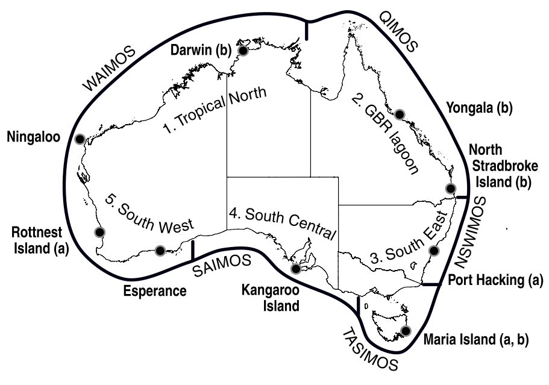
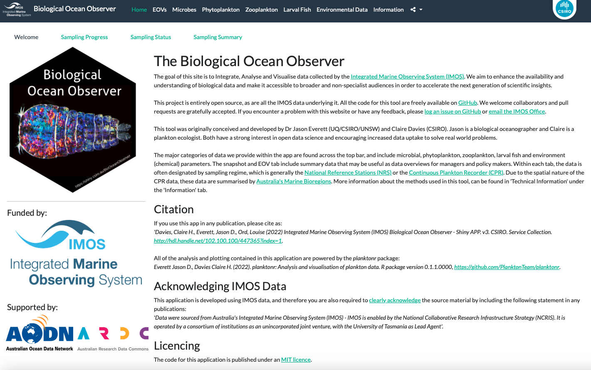

 
 
    
       Physical-Biological Oceanography (MARS3012)
 
 
 State of the Marine Environment - IMOS National Reference Stations

 **Authors:** Jason D. Everett* (UQ, CSIRO, UNSW) and Claire H. Davies (CSIRO) 

*Jason.Everett@uq.edu.au 

In this practical we will use the newly developed Biological Ocean Observer to explore patterns and trends at the IMOS National Reference Stations. You will then use what you discover to write a short (1 page + figures) report integrating the physical, chemical and biological observations to describe the State of the Marine Environment.

# IMOS National Reference Stations

The Integrated Marine Observing System (IMOS) is a national ocean observing system measuring the physical, chemical and biological environment. It is one of the national research infrastructure capabilities currently supported under the Australian Government’s National Collaborative Research Infrastructure Strategy (NCRIS). IMOS has been awarded \$144M of Australian Government funding over 10 years (2006-2016), with matching co-investment of \$200M. Plankton observations within IMOS are provided by the Australian Continuous Plankton Recorder survey (AusCPR) and the National Reference Stations (NRS) program (Davies et al. 2014).

The National Reference Stations collect observations of both physical and biogeochemical variables to characterise the ocean environment and to understand fundamental biological processes within the environment. Core variables observed include temperature, salinity, dissolved oxygen, nutrients, turbidity, carbon, phytoplankton, and zooplankton. 

The vessel-based sampling comprises: 1) Vertical profiling sensor measurements of conductivity (salinity), temperature and depth, oxygen, fluorometry and turbidity; 2) Niskin bottle samples at discrete 10 m intervals for measurements of total dissolved inorganic carbon, alkalinity and nutrients; 3) A sample from surface Niskin bottles for phytoplankton and pigments; 4) Zooplankton samples from a plankton drop net; 5) Measurement of turbidity with a Secchi disk; and 6) Some station-specific samples (i.e. Larval Fish)

As scientists, Claire and I are particularily interested in the state and trends of the phytoplankton and zooplankton, but we use the physical and chemical observations to interpret the plankton.
 

# Why is plankton important?

Plankton dominates the biomass of marine systems. Each day, phytoplankton perform nearly half of the photosynthesis on Earth, mixing 100 million tons of carbon dioxide and producing half of the oxygen we breathe. The most common zooplankton, the copepods, are the most abundant animals on Earth, even outnumbering insects (Schminke 2006). The carrying capacity of marine systems – the biomass of exploited fish, squid and shellfish, the numbers of charismatic marine mammals, seabirds and sea turtles, and the diverse bottom-dwelling communities of crabs and fish – are determined by the biomass, growth, timing, and composition of the plankton.

Plankton impacts human health. Some phytoplankton species produce toxins and form large harmful algal blooms or red tides, which can contaminate shellfish and cause a suite of poisoning syndromes and death in humans. Some zooplankton are venomous, such as the box jellyfish *Chironex fleckeri* and Irukandji species, which close beaches in northern Australia and can cause severe pain and death.

Plankton infuence the pace and extent of climate change. Many phytoplankton species produce chemicals that evaporate from the ocean, helping to form clouds, which cause rain and reflect solar radiation back to space. Plankton also shunts carbon from the surface to the deep ocean by fixing carbon through photosynthesis. This carbon is transferred to zooplankton grazers, sinking to the ocean  oor as faeces or dead carcasses, where it can be removed from the atmosphere for thousands to millions of years – a process known as the biological pump. The type of phytoplankton present can have a significant influence on the efficiency of carbon export, as larger species sink more quickly. Movement of carbon to the deep ocean by plankton has contributed to the ocean uptake of 40% of the carbon dioxide produced by people – it would be much warmer if this carbon had not been taken up by the ocean. Over geological time, the accumulation of carbon from plankton on the sea oor has formed the oil and natural gas deposits we use today. 

Without plankton, the Earth would be warmer and devoid of large fish and charismatic animals. In fact, much of the economic value of the oceans, estimated at US$21 trillion per annum and similar to the global gross national product (Costanza et al. 1997), is provided by plankton through fishery production, nutrient cycling, gas production and climate regulation.

# Plankton as ecological indicators

Indicators are simple measures of the state of a system. Plankton provides ideal indicators of ecosystem health and ecological change because it is abundant, short-lived, not harvested, and sensitive to changes in temperature, acidity and nutrients. Plankton has thus been used as indicators for climate change, eutrophication,  fisheries, invasive species, ecosystem health and biodiversity (Edwards et al. 2011). Here, we use the term ecological indicator as a measure of ecosystem state without considering a threshold level that triggers management intervention as in fisheries management.

# The State of the Marine Environment 

There are many examples of integrated assessments of the environment. These include the National <a href=https://soe.dcceew.gov.au> "State of the Environment"</a> report which is released every 5 years as legislated by The Environment Protection and Biodiversity Conservation Act 1999 (EPBC Act). Australia's state of the environment 2021 (SoE 2021) assesses the changing condition of our natural environment across 12 themes: air quality, Antarctica, biodiversity, climate, coasts, extreme events, heritage, Indigenous, inland water, land, marine and urban.

State-based reports are also released regularly, including the <a href="https://www.stateoftheenvironment.des.qld.gov.au"> Queensland State of the Environment Report </a>. 

A team within IMOS has also produced similar reports including <a href = "https://imos.org.au/fileadmin/user_upload/shared/Data_Tools/15-00245_OA_Plankton2015_20ppBrochure_WEB_151116.pdf"> Plankton 2015 </a> and the <a href = "https://www.imosoceanreport.org.au"> IMOS State and Trends of Australia's Oceans </a>.

# The Biological Ocean Observer

The <a href="https://shiny.csiro.au/BioOceanObserver/"> Biological Ocean Observer </a> is an open-source tool built in R and Shiny by Jason and Claire. Its goal is to Integrate, Analyse and Visualise data collected by the Integrated Marine Observing System (IMOS). It aims to enhance the availability and understanding of biological data and make it accessible to broader and non-specialist audiences in order to accelerate the next generation of scientific insights. Besides students and scientists, one key audience of this tool is policy makers and managers at local, state and national levels. 

The Biological Ocean Observer can be found here: https://shiny.csiro.au/BioOceanObserver/

Imagine you are a state government official, and you have been asked by your minister to write a 1 page briefing document that describes the current state and trends of the ocean in your state. You know that IMOS has the longest and most consistent time-series of data, so you decide to use the IMOS National Reference Station to base your report on. You know that 1 site can't be representative of the whole region, but it is the best data you have for the moment.

 
 
 

